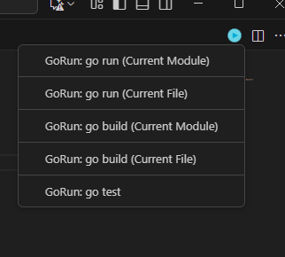

# GoRunner 

An extension to quickly run Go codes without typing in the terminal

## Features

GoRunner is a simple extension for Visual Studio Code that simplifies the execution and building process of a Go project

### Available commands:

- go run "currentfile".go / go run .

- go build "currentfile".go / go build .

- go test

## Release Notes

### 1.0.0
- Initial Release

